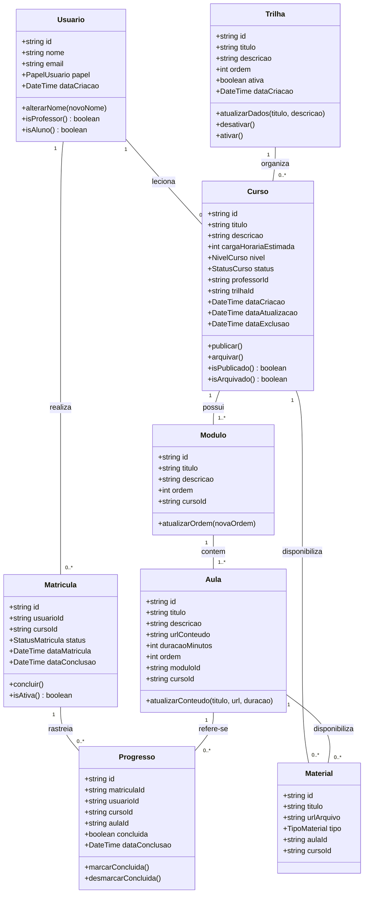

# 📐 Modelagem das Entidades de Domínio (Linguagem Ubíqua PT-BR)

> **Projeto:** Plataforma de Ensino de Programação  
> **Padrão:** Domain-Driven Design (DDD) — Modelo Híbrido  
> **Convenção:** Entidades e regras de negócio em Português (`Curso`, `Aula`, `Trilha`); termos de arquitetura em inglês (`Repository`, `UseCase`, `Controller`).  
> **Fonte da Verdade:** [`Aprendizado/consolidation/README.md`](../README.md) e [`Requisitos.md`](./Requisitos.md)  

---

## 1. Visão Geral do Domínio

O núcleo (*Core Domain*) da plataforma modela a jornada de aprendizagem do aluno sob a curadoria do professor. As entidades foram projetadas como **Entidades Ricas de Domínio**, encapsulando seus dados e contendo métodos explícitos para garantir que nenhuma regra de negócio seja violada (invariantes protegidos).

---

## 2. Tipos e Enums do Domínio

### 2.1 `PapelUsuario`
Define os níveis de permissão (RBAC) do sistema:
* `ALUNO` — Estudante com acesso a cursos matriculados.
* `PROFESSOR` — Administrador e curador de conteúdos da plataforma.

### 2.2 `StatusCurso`
Ciclo de vida de um curso:
* `RASCUNHO` — Curso em elaboração pelo professor; invisível para alunos.
* `PUBLICADO` — Curso ativo no catálogo e aberto a matrículas.
* `ARQUIVADO` — Curso descontinuado para novas matrículas, mas acessível aos alunos matriculados anteriormente (Soft Delete).

### 2.3 `NivelCurso`
Complexidade didática do curso:
* `INICIANTE`
* `INTERMEDIARIO`
* `AVANCADO`

### 2.4 `StatusMatricula`
* `ATIVA` — Aluno cursando.
* `CONCLUIDA` — Aluno finalizou 100% das aulas.
* `CANCELADA` — Matrícula desativada.

---

## 3. Especificação das Entidades

### 3.1 Entidade: `Usuario`
Representa qualquer pessoa autenticada na plataforma.
* **Atributos:**
  * `id: string` (CUID)
  * `nome: string` (mínimo de 3 caracteres)
  * `email: string` (formato de e-mail válido)
  * `papel: PapelUsuario`
  * `avatarUrl?: string`
  * `dataCriacao: Date`
* **Invariantes e Regras:**
  * O nome não pode ser vazio e deve ter pelo menos 3 caracteres.
  * O e-mail não pode ter espaços e deve ser normalizado em minúsculas.
  * Por padrão, todo novo usuário cadastrado na plataforma pública recebe o papel `ALUNO`.

### 3.2 Entidade: `Curso` (Raiz de Agregado)
Representa uma unidade de ensino completa com módulos e aulas.
* **Atributos:**
  * `id: string`
  * `titulo: string` (mínimo de 5 caracteres)
  * `descricao: string`
  * `cargaHorariaEstimada: number` (horas inteiras > 0)
  * `nivel: NivelCurso`
  * `status: StatusCurso`
  * `professorId: string`
  * `trilhaId?: string`
  * `dataCriacao: Date`
  * `dataAtualizacao: Date`
  * `dataExclusao?: Date | null`
* **Métodos de Domínio:**
  * `publicar()`: Altera o status para `PUBLICADO`. Só é permitido se o curso contiver pelo menos uma aula cadastrada.
  * `arquivar()`: Altera o status para `ARQUIVADO` e preenche `dataExclusao = new Date()` (Soft Delete).
  * `podeReceberMatricula()`: Retorna `true` estritamente se `status === StatusCurso.PUBLICADO`.

### 3.3 Entidade: `Aula`
Representa uma lição específica ministrada em vídeo, texto ou exercícios.
* **Atributos:**
  * `id: string`
  * `titulo: string`
  * `descricao?: string`
  * `urlConteudo: string` (URL do vídeo ou caminho do conteúdo)
  * `duracaoMinutos: number` (>= 0)
  * `ordem: number` (posicionamento sequencial dentro do módulo)
  * `moduloId: string`
  * `cursoId: string`
* **Métodos de Domínio:**
  * `atualizarOrdem(novaOrdem: number)`
  * `atualizarConteudo(titulo, url, duracao)`

### 3.4 Entidade: `Matricula`
Representa o vínculo formal de um aluno com um curso.
* **Atributos:**
  * `id: string`
  * `usuarioId: string`
  * `cursoId: string`
  * `status: StatusMatricula`
  * `dataMatricula: Date`
  * `dataConclusao?: Date | null`
* **Métodos de Domínio:**
  * `concluir()`: Altera o status para `CONCLUIDA` e registra `dataConclusao = new Date()`.
  * `isAtiva()`: Retorna `true` se `status === StatusMatricula.ATIVA`.

### 3.5 Entidade: `Progresso`
Rastreia o cumprimento de uma aula específica por um aluno matriculado.
* **Atributos:**
  * `id: string`
  * `matriculaId: string`
  * `usuarioId: string`
  * `cursoId: string`
  * `aulaId: string`
  * `concluida: boolean`
  * `dataConclusao?: Date | null`
* **Métodos de Domínio:**
  * `marcarConcluida()`: Se já estiver concluída, não faz nada (idempotência); se não, altera `concluida = true` e preenche `dataConclusao = new Date()`.
  * `desmarcarConcluida()`: Altera `concluida = false` e define `dataConclusao = null`.

### 3.6 Objeto de Domínio: `CalculadoraProgresso` (Domain Service)
Calcula a taxa de conclusão do aluno em um curso:
$$\text{Percentual} = \left( \frac{\text{Total de Aulas Concluídas}}{\text{Total de Aulas Ativas do Curso}} \right) \times 100$$
* Se total de aulas ativas for zero, percentual = 0%.
* Se percentual == 100%, emite o status de elegibilidade para conclusão da matrícula.

---

## 4. Erros Semânticos de Domínio

O domínio lança erros específicos que não possuem dependências com códigos HTTP:

* `RegraDeNegocioError` (classe base)
* `CursoNaoPublicadoError` — Tentativa de matrícula em curso em rascunho ou arquivado.
* `MatriculaDuplicadaError` — Aluno já possui matrícula ativa no curso.
* `AulaNaoEncontradaError` — Referência a aula inexistente.
* `AcessoNaoAutorizadoError` — Acesso a aula ou material sem matrícula ativa.
* `CursoSemAulasParaPublicacaoError` — Tentativa de publicar curso sem aulas.
