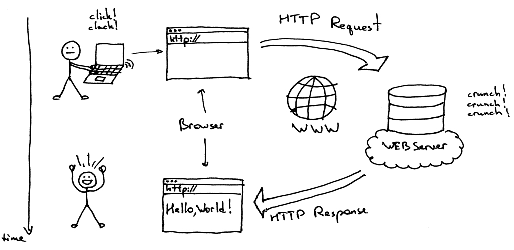

# Backend com Bun + Express

Este documento descreve o passo a passo de aprendizado para iniciar um backend
simples com Bun, TypeScript e Express. O foco e mentoria pratica, com contexto
real e pontos de debug.

## Base do tema
Backend e a parte do sistema que roda no servidor. Ele recebe pedidos, aplica
regras e devolve respostas. E onde vivem as regras do negocio, a integracao com
banco de dados e a seguranca basica.

Como a web funciona:
- O cliente (navegador, app) faz um pedido (request) ao servidor.
- O servidor processa o pedido e devolve uma resposta (response).
- O protocolo HTTP define verbos (GET, POST), status (200, 404) e formatos
  (JSON, HTML).



Video de apoio (HTTP request e response):
- https://www.youtube.com/watch?v=Gg-YfLdBaow

## O que e uma API
API e a forma padrao de conversa entre sistemas. Uma API define rotas e formatos
de dados para que um cliente (web, mobile, outro servico) consiga usar o backend
sem precisar conhecer sua implementacao interna.
### REST e RESTful

REST (Representational State Transfer) é um padrão arquitetural que usa HTTP para criar APIs previsíveis. Cada recurso tem uma URL, e você usa os verbos HTTP (GET, POST, PUT, DELETE) para operar sobre ele.

Exemplo:
- `GET /tasks` — lista todas as tarefas.
- `POST /tasks` — cria uma tarefa.
- `PUT /tasks/1` — atualiza a tarefa com id 1.
- `DELETE /tasks/1` — remove a tarefa com id 1.

Uma API **RESTful** segue rigorosamente esses princípios: URLs descrevem recursos, não ações; status HTTP comunicam resultados; e as respostas são previsíveis.

### Outras abordagens

Existem alternativas ao REST:
- **GraphQL:** Cliente define exatamente que dados quer. Reduz overfetching.
- **gRPC:** Comunição binária e eficiente entre serviços. Mais comum em microsserviços.
- **WebSockets:** Conexão bidirecional e contínua. Ideal para chat, notificações em tempo real.
- **Message Queues (RabbitMQ, Kafka):** Desacoplamento entre serviços via filas.

Para iniciantes, **REST é o ponto de partida ideal** porque é simples e cobre 80% dos casos reais.

Video de apoio (API):
- https://www.youtube.com/watch?v=TRAzo48Souc

## Contexto real
Voce vai criar uma API de tarefas simples para um time interno.
A primeira entrega e subir um servidor local com um endpoint de saude.

## Objetivo
- Subir um servidor com Bun e Express.
- Entender o fluxo de request e response.
- Criar um endpoint de saude e um endpoint de criacao.

## Pre-requisitos
- Node.js e Bun instalados no sistema.
- Editor de codigo com suporte a TypeScript.
- Conhecimento basico de linha de comando.

## Passo a passo (documentacao oficial + mentoria)
Fonte: https://bun.com/docs/guides/ecosystem/express

```bash
bun init
# escolha o template "typescript"
bun add express
```

Crie o arquivo `server.ts` com o exemplo basico do Express e rode:

```bash
bun server.ts
# ou
bun --hot server.ts
```

Valide no navegador com `http://localhost:3000/`.

Exemplo de base (resumo do que voce deve criar):

```ts
import express from "express";

const app = express();
const port = Number(process.env.PORT) || 3000;

app.use(express.json());

type Task = {
  id: number;
  title: string;
};

const tasks: Task[] = [];

app.get("/health", (_req, res) => {
  res.status(200).json({ status: "ok" });
});

app.post("/tasks", (req, res) => {
  const title = String(req.body?.title || "").trim();

  if (!title) {
    return res.status(400).json({ error: "title is required" });
  }

  const task: Task = {
    id: tasks.length + 1,
    title
  };

  tasks.push(task);

  return res.status(201).json(task);
});

app.listen(port, () => {
  console.log(`Listening on http://localhost:${port}`);
});
```

## Checklist do codigo base
- Servidor Express ouvindo na porta definida em `PORT` com fallback.
- Middleware `express.json()` habilitado antes das rotas.
- Rota `GET /health` retornando `{ "status": "ok" }`.
- Rota `POST /tasks` salvando em memoria (array).

## Como testar (com curl)
```bash
curl http://localhost:3000/health

curl -X POST http://localhost:3000/tasks \
  -H "Content-Type: application/json" \
  -d '{"title":"Estudar Bun"}'
```

## Desafio de debug (erro intencional)
- Sintoma: `POST /tasks` retorna 415 ou body vazio.
- Causa provavel: `express.json()` nao foi registrado antes das rotas.
- Caminho de investigacao:
  - Verifique a ordem dos middlewares.
  - Logue `req.headers["content-type"]` e `req.body`.

## Erros comuns
- Porta ocupada: troque `PORT` ou finalize o processo anterior.
- Rota nao encontrada (404): verifique o caminho e o verbo HTTP.
- Body vazio: confirme `Content-Type: application/json` no cliente.

## Por que Express nesta etapa
- API simples de entender para iniciantes.
- Facil de migrar para Fastify depois, mantendo rotas e DTOs.

## Proximo passo
- Adicionar validacao com Zod e tipar DTOs compartilhados.
- Abrir um Draft PR para pedir feedback do time.

## Exercicio sugerido
Crie um pequeno repo com o projeto do aluno e implemente:
- `GET /health` retornando `{ "status": "ok" }`.
- `POST /tasks` recebendo `{ "title": "..." }`.
- Retorno com `id` incremental e `title` no JSON.

Entrega esperada:
- Estrutura minima: `server.ts`, `package.json` e um `README.md` curto.
- Um commit com mensagem no imperativo (ex.: "Add health and tasks routes").
- Link do repositorio enviado ao mentor para feedback.

Ninguem evolui sozinho. Convide alguem para pair programming.
